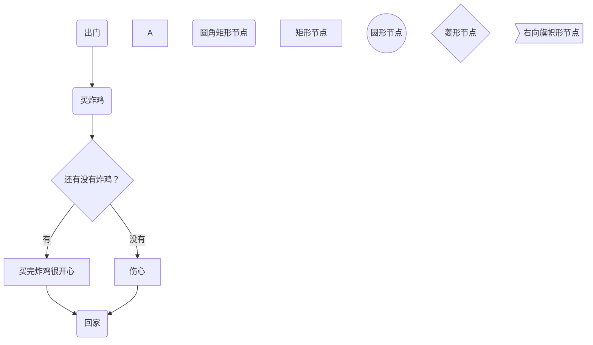
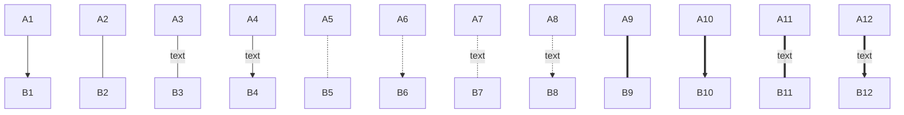
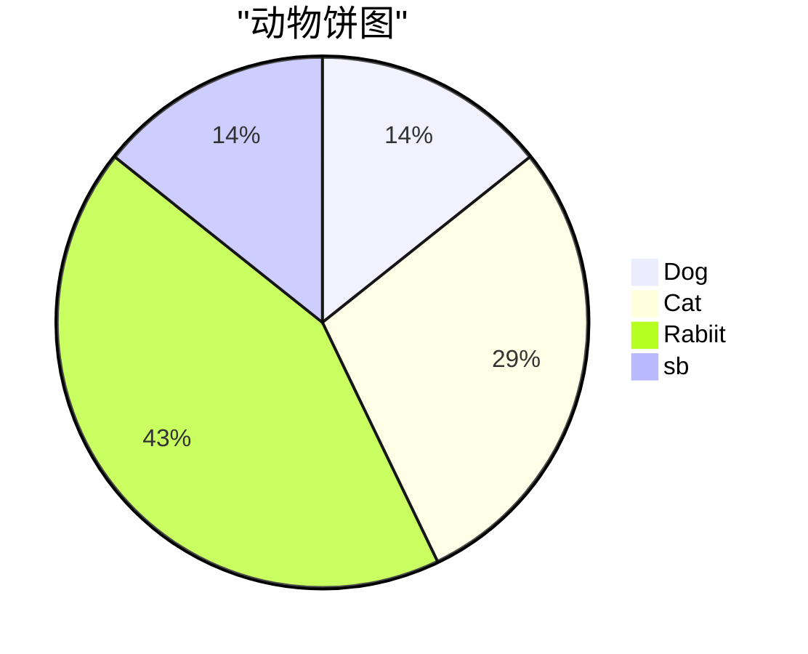
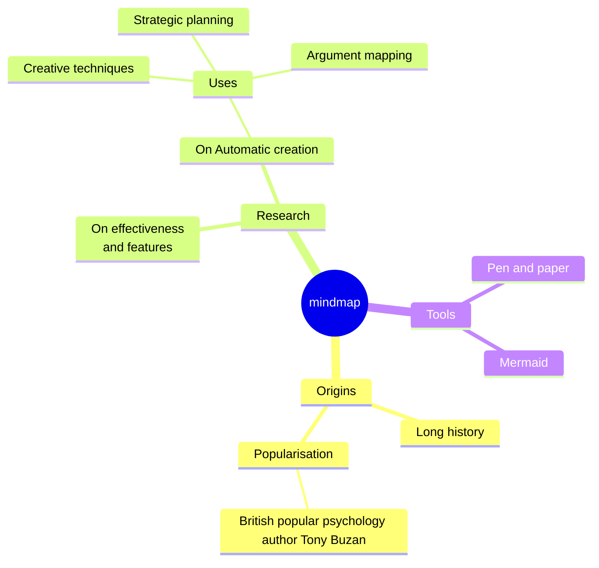

## table

| First Header | Second Header |
| ------------ | ------------- |
| Content Cell | Content Cell  |
| Content Cell | Content Cell  |

| Left-Aligned  | Center Aligned  | Right Aligned |
| :------------ | :-------------: | ------------: |
| col 3 is      | some wordy text |         $1600 |
| col 2 is      |    centered     |           $12 |
| zebra stripes |    are neat     |            $1 |

## graph



连线







## Markdown Cheat Sheet Markdown 基本语法

Thanks for visiting [The Markdown Guide](https://www.markdownguide.org)!

This Markdown cheat sheet provides a quick overview of all the Markdown syntax elements. It can’t cover every edge case, so if you need more information about any of these elements, refer to the reference guides for [basic syntax](https://www.markdownguide.org/basic-syntax) and [extended syntax](https://www.markdownguide.org/extended-syntax).

## Basic Syntax

These are the elements outlined in John Gruber’s original design document. All Markdown applications support these elements.

### Heading

# H1

## H2

### H3

### Bold

**bold text**

### Italic

_italicized text_

### Blockquote

> blockquote

### Ordered List

1. First item
2. Second item
3. Third item

### Unordered List

- First item
- Second item
- Third item

### Code

`code`

### Horizontal Rule

---

### Link

[Markdown Guide](https://www.markdownguide.org)

### Image


## Extended Syntax

These elements extend the basic syntax by adding additional features. Not all Markdown applications support these elements.

### Table

| Syntax    | Description |
| --------- | ----------- |
| Header    | Title       |
| Paragraph | Text        |

### Fenced Code Block

```json
{
  "firstName": "John",
  "lastName": "Smith",
  "age": 25
}
```

### Footnote

Here's a sentence with a footnote. [^1]

Here's a sentence with a footnote2. [^2]

[^1]: This is the footnote.
[^2]: This is the footnote.

### Heading ID

### My Great Heading {#custom-id}

### Definition List

term
: definition

### Strikethrough

~~The world is flat.~~

### Task List

- [x] Write the press release
- [ ] Update the website
- [ ] Contact the media

### Emoji

That is so funny! :joy:

(See also [Copying and Pasting Emoji](https://www.markdownguide.org/extended-syntax/#copying-and-pasting-emoji))

### Highlight

I need to highlight these ==very important words==.

### Subscript

H~2~O

### Superscript

X^2^

## 数学符号和公式

### 希腊字母表

|                |            |              |          |
| :------------: | :--------: | :----------: | :------: |
|      符号      |    代码    |     符号     |   代码   |
|   α \alpha α   |   \alpha   |  A \Alpha A  |  \Alpha  |
|   β \beta β    |   \beta    |  B \Beta B   |  \Beta   |
|   γ \gamma γ   |   \gamma   |  Γ \Gamma Γ  |  \gamma  |
|   δ \delta δ   |   \delta   |  Δ \Delta Δ  |  \Delta  |
|  ϵ \epsilon ϵ  |  \epsilon  | E \Epsilon E | \Epsilon |
|   ζ \zeta ζ    |   \zeta    |  Z \Zeta Z   |  \Zeta   |
|    η \eta η    |    \eta    |   H \Eta H   |   \Eta   |
|   θ \theta θ   |   \theta   |  Θ \Theta Θ  |  \Theta  |
|   ι \iota ι    |   \iota    |  I \Iota I   |  \Iota   |
|   κ \kappa κ   |   \kappa   |  K \Kappa K  |  \Kappa  |
|  λ \lambda λ   |  \lambda   | Λ \Lambda Λ  | \Lambda  |
|    μ \mu μ     |    \mu     |   M \Mu M    |   \Mu    |
|    μ \mu μ     |    \nu     |   N \Nu N    |   \Nu    |
|    ν \nu ν     |    \xi     |   Ξ \Xi Ξ    |   \Xi    |
|  ο \omicron ο  |  \omicron  | O \Omicron O | \Omicron |
|    π \pi π     |    \pi     |   Π \Pi Π    |   \Pi    |
|    ρ \rho ρ    |    \rho    |   P \Rho P   |   \Rho   |
|   σ \sigma σ   |   \sigma   |  Σ \Sigma Σ  |  \Sigma  |
|    τ \tau τ    |    \tau    |   T \Tau T   |   \Tau   |
|  υ \upsilon υ  |  \upsilon  | Υ \Upsilon Υ | \Upsilon |
|    ϕ \phi ϕ    |    \phi    |   Φ \Phi Φ   |   \Phi   |
|    χ \chi χ    |    \chi    |   X \Chi X   |   \Chi   |
|    ψ \psi ψ    |    \psi    |   Ψ \Psi Ψ   |   \Psi   |
|   ω \omega ω   |   \omega   |  Ω \Omega Ω  |  \Omega  |
| ≜ \triangleq ≜ | \triangleq |              |          |
|  ∂ \partial ∂  |  \partial  |              |          |
|    ξ \xi ξ     |    \xi     |              |          |

### 希腊字母

### 数学符号

|           **描述**            |                                          **符号**                                           |                         **代码**                          |
| :---------------------------: | :-----------------------------------------------------------------------------------------: | :-------------------------------------------------------: |
|           求和公式            |                                          ∑ \sum ∑                                           |                           \sum                            |
|          求和上下标           |                                ∑ i = 0 n \sum\_{i=0}^n ∑i=0n                                |                       \sum\_{i=0}^n                       |
|           叉乘/点乘           |                                    × \times × ⋅ \cdot ⋅                                     |                       \times \cdot                        |
|            正负号             |                                           ± \pm ±                                           |                            \pm                            |
|             除号              |                                          ÷ \div ÷                                           |                           \div                            |
|             竖线              |                                          ∣ \mid ∣                                           |                           \mid                            |
|              点               |                                          ⋅ \cdot ⋅                                          |                           \cdot                           |
|              圈               |                                          ∘ \circ ∘                                          |                           \circ                           |
|             星号              |                                           $\ast $                                           |                           \ast                            |
|          克罗内克积           |                                       ⨂ \bigotimes ⨂                                        |                        \bigotimes                         |
|             异或              |                                        ⨁ \bigoplus ⨁                                        |                         \bigoplus                         |
|           小于等于            |                                          ≤ \leq ≤                                           |                           \leq                            |
|           大于等于            |                                          ≥ \geq ≥                                           |                           \geq                            |
|            不等于             |                                          ≠ \neq =                                          |                           \neq                            |
|            约等于             |                                         ≈ \approx ≈                                         |                          \approx                          |
|           N 元乘积            |                                          ∏ \prod ∏                                          |                           \prod                           |
|           N 元余积            |                                         ∐ \coprod ∐                                         |                          \coprod                          |
|            省略号             |                                         ⋯ \cdots ⋯                                          |                          \cdots                           |
|             积分              |                                          ∫ \int ∫                                           |                           \int                            |
|           双重积分            |                                          ∬ \iint ∬                                          |                           \iint                           |
|           曲线积分            |                                          ∮ \oint ∮                                          |                           \oint                           |
|             无穷              |                                         ∞ \infty ∞                                          |                          \infty                           |
|             梯度              |                                         ∇ \nabla ∇                                          |                          \nabla                           |
|             因为              |                                        ∵ \because ∵                                         |                         \because                          |
|             所以              |                                       ∴ \therefore ∴                                        |                        \therefore                         |
|             任意              |                                         ∀ \forall ∀                                         |                          \forall                          |
|             存在              |                                         ∃ \exists ∃                                         |                          \exists                          |
|            不等于             |                                         ≠ \not= =                                          |                           \not=                           |
|            不大于             |                                         ≯ \not> >                                          |                           \not>                           |
|           小于等于            |                                          ≤ \leq ≤                                           |                           \leq                            |
|           大于等于            |                                          ≥ \geq ≥                                           |                           \geq                            |
|            不属于             |                                      ⊄ \not\subset ⊂                                       |                        \not\subset                        |
|             空集              |                                        ∅ \emptyset ∅                                        |                         \emptyset                         |
|             属于              |                                           ∈ \in ∈                                           |                            \in                            |
|            不属于             |                                         ∉ \notin ∈/                                         |                          \notin                           |
|             子集              |                                         ⊂ \subset ⊂                                         |                          \subset                          |
|            真子集             |                                        ⊆ \subseteq ⊆                                        |                         \subseteq                         |
|             并集              |                                         ⋃ \bigcup ⋃                                         |                          \bigcup                          |
|             交集              |                                         ⋂ \bigcap ⋂                                         |                          \bigcap                          |
|            逻辑或             |                                         ⋁ \bigvee ⋁                                         |                          \bigvee                          |
|            逻辑与             |                                        ⋀ \bigwedge ⋀                                        |                         \bigwedge                         |
|            期望值             |                                       y ^ \hat{y} y^                                        |                          \hat{y}                          |
|            多重集             |                                        ⨄ \biguplus ⨄                                        |                         \biguplus                         |
|                               |                                      y ˇ \check{y} yˇ                                       |                         \check{y}                         |
|            平均值             |                         a + b + c + d ‾ \overline{a+b+c+d} a+b+c+d                          |                    \overline{a+b+c+d}                     |
|                               |                         a + b + c + d ‾ \underline{a+b+c+d} a+b+c+d                         |                    \underline{a+b+c+d}                    |
|            大括号             |   a + b + c ⏟ 1.0 + d ⏞ 2.0 \overbrace{a+\underbrace{b+c}\_{1.0}+d}^{2.0} a+1.0 b+c+d2.0    |       overbrace{a+\underbrace{b+c}\_{1.0}+d}^{2.0}        |
|            绝对值             |                                              $                                              |                           算式                            |
|            开平方             |                                         x \sqrt x x                                         |                          \sqrt x                          |
|           开多次方            |                 被 开 方 数 开 方 数 \sqrt[开方数]{被开方数} 开方数被开方数                 |                  \sqrt[开方数]{被开方数}                  |
|             对数              |                                  log ⁡ 5 x \log_5{x} log5x                                  |                         \log_5{x}                         |
|             极限              |                                       lim ⁡ \lim lim                                        |                           \lim                            |
|                               | lim ⁡ y → 0 x → ∞ x y \displaystyle \lim^{x \to \infty}\_{y \to 0}{\frac{x}{y}} y→0limx→∞yx | \displaystyle \lim^{x \to \infty}\_{y \to 0}{\frac{x}{y}} |
|                               |        lim ⁡ y → 0 x → ∞ x y \lim^{x \to \infty}\_{y \to 0}{\frac{x}{y}} limy→0x→∞yx        |        \lim^{x \to \infty}\_{y \to 0}{\frac{x}{y}}        |
|            约等于             |                                         ≈ \approx ≈                                         |                          \approx                          |
|            恒等于             |                                         ≡ \equiv ≡                                          |                          \equiv                           |
|             差集              |                                        ∖ \setminus ∖                                        |                         \setminus                         |
|           同或运算            |                                        ⨀ \bigodot ⨀                                         |                         \bigodot                          |
|           同与运算            |                                       ⨂ \bigotimes ⨂                                        |                        \bigotimes                         |
|           常用数集            |                                       R \mathbb{R} R                                        |                    \mathbb{R} {N} {Q}                     |
|             空集              |                                         ∅ \empty ∅                                          |                          \empty                           |
|             无穷              |                                         ∞ \infty ∞                                          |                          \infty                           |
|             虚数              |                                         ı \imath ı                                          |                          \imath                           |
|           向量符号            |                                   字 母 ⃗ \vec{字母} 字母                                   |                        \vec{字母}                         |
|                               |                                         ⊕ \oplus ⊕                                          |                          \oplus                           |
| 字 母 \pmb{字母} 字母字母字母 |                                         \pmb{字母}                                          |                                                           |
|           加粗倾斜            |                                字 母 \boldsymbol{字母} 字母                                 |                     \boldsymbol{字母}                     |

### 数学符号

$$
\int_0^\infty \frac{x^3}{e^x-1}\,dx = \frac{\pi^4}{15}
$$
