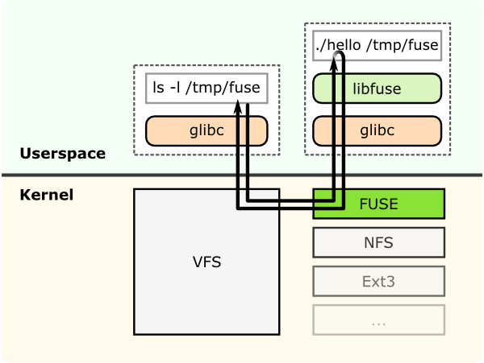

## 简介

## 基础概念

FUSE (File System in Userspace)

## FAQ

yum install -y glusterfs-server
#CentOS8安装此步骤会遇到依赖问题：nothing provides python3-pyxattr needed by glusterfs-server-7.7-1.el8.x86_64
#解决方法：从第三方安装python3-pyxattr 
#yum install -y ftp://ftp.pbone.net/mirror/archive.fedoraproject.org/fedora/linux/releases/27/Everything/x86_64/os/Packages/p/python3-pyxattr-0.5.3-12.fc27.x86_64.rpm

## 参考资料

[初探glusterFS](https://www.cnblogs.com/ltzhang/p/13657317.html)

